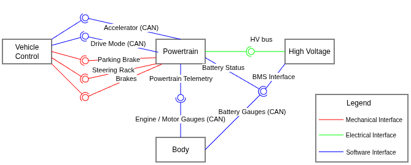

# Architectural Design

This document exists to decompose the project into modules and define the interfaces between them.
For the purpose of this project a module is a set of related concerns / functionality which is cleanly separable from other functionality by a set of interfaces. 

### Software Interfaces
Many modules have software interfaces between them. When possible, CAN will be used for all software interfaces. CAN has excellent tolerance to noise and is commonly used in automotive applications. BMS / Inverter hardware and firmware will often support CAN.

### Mechanical Interfaces
Some modules have mechanical interfaces. These are specified mostly to make it clear what parts of what components are part of each module. The "schema" of a mechanical interface is challenging to specify in advance since it often depends on module implementation details.

## Powertrain Module

This module includes:

- Drivetrain components e.g. transmission, axles
- Fuel tank location and fuel line routing
- Exhaust
- Powertrain controls

### Exposed Interfaces

#### Accelerator Control
The accelerator control will be exposed via a CAN interface

#### Drive Mode
The drive mode will be exposed via a CAN interface

#### Brakes
A physical interface via hydraulic connector to the brakes is exposed.
It is up to the connecting module to handle routing of the brake lines, brake actuation, and power brake assist

#### Steering
A physical interface via the steering rack is exposed.
It us up to the connecting module to handle the connection from the steering wheel to the steering rack, and any power assist.

#### Parking Brake
A physical interface via the parking brake mechanism is exposed. It is up to the connecting module to handle the connection to the parking brake e.g. via a cable.

### Required Interfaces

#### High Voltage Connection
An electrical connection is required to the high voltage battery for use transferring power to / from the motor

#### BMS Interface
A software interface is required to the BMS is required for use by powertrain controls.

## High Voltage Module

This module includes:

- High voltage battery design and placement in the vehicle
- BMS firmware
- Battery thermal control
- High voltage wiring
- High voltage battery charging

### Exposed Interfaces
#### BMS Interface
A CAN interface to the battery via the BMS is exposed. This can be used to get information on the battery capacity, temperature etc.

#### High Voltage Connection
An electrical interface to the high voltage bus is exposed.

## Body Module

This module includes:

- Noise, Vibration, and Harshness (NVH)
- Guage cluster
- Occupant safety
- Climate Control

### Required Interfaces

#### BMS Interface
A software interface to the BMS is required to provide battery information in the guage cluster.

#### Powertrain Telemetry
A Software interface to the powertrain is required to provide powertrain information to the guage cluster.

## Vehicle Control Module

This module includes:

- Steering
- Brakes
- Parking Brake
- Accelerator pedal
- Drive mode selection

### Required Interfaces

#### Accelerator
An interface is required to provide information from the accelerator pedal to the powertrain controls.

#### Drive Mode
An interface is required to provide information about the drive mode to the powertrain controls.

#### Parking Brake
An interface is required so that the parking brake can be actuated.

#### Steering Rack
An interface is required to provide steering input to the vehicle.

#### Brakes
An interface is required to the brakes to stop the vehicle.

<figure markdown="span">
  
  <figcaption>Module Architecture</figcaption>
</figure>
