# High Voltage Module Design

This document contains the detailed design of the high voltage module.
The purpose is to provide concrete information for the powertrain module and act as a decision log, containing not only the final design, but an explanation of why the design was chosen over alternatives.
For now, the scope of the design is limited to parts selection for major components like the battery.
Details like mounting brackets and wiring are currently unspecified because not enough information is available to model them accurately.
Once a donor body is acquired more detail can be added.

## Battery Modules

EV battery packs are often built to conform to the shape of the vehicle they came in.
Although the Travelall is large, because of the complex powertrain, space is at a premium and reusing an entire battery pack from an existing EV is not possible.
A custom battery pack(s) will be required for this project.

EV battery packs are made out of multiple battery modules.
Battery modules combine multiple battery cells in series and parallel into a component which is convenient for packaging, or connecting to a BMS (Battery Management System).
The characteristics to consider when selecting a battery module to build a pack are its voltage, capacity, dimensions, weight, cost, thermal management, and connection to a BMS.

This section will cover several battery modules and potential placement in the chassis.

### Nissan Leaf Battery Module

#### Description

The Nissan Leaf battery modules are a common choice for EV conversions due to their high voltage and small size which lets them be packed into convenient locations.
Pre-2025 the Leaf only had passive battery thermal management meaning heat from the battery had to gradually dissipate to the exterior.
This resulted in high battery degradation due to overheating, but the batteries are very affordable which further contributes to their popularity.

The Leaf modules changed slightly over the years but the general specs are similar.

| Module Parameter | Value |
| --------- | ----- |
| Voltage | 7.6 V |
| Capacity | 500 Wh |
| Dimensions | 12" x 8.8" x 1.4" |
| Weight | 8.4 lbs |
| Approx. Cost | $21.76 buying in bulk from [greentec](https://greentecauto.com/hybrid-battery/repurposed-batteries/nissan-leaf/g2-nissan-leaf-lmo-7-6v-64ah-500wh-bulk-purchase/) |
| Thermal Management | Passive |
| BMS | No |
| Chemistry | NMC |

<figure markdown="span">
  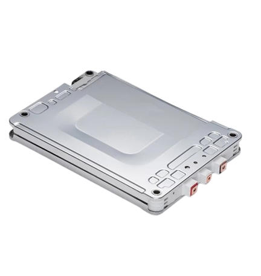
  <figcaption>Nissan Leaf Battery Module</figcaption>
</figure>

In order to meet the minimum pack capacity [requirement](system_design.md#capacity) roughly 48 modules are required, although greentec bulk used batteries appear to be de-rated and it may take up to 75 modules according to the bulk battery [listing](https://greentecauto.com/hybrid-battery/repurposed-batteries/nissan-leaf/g2-nissan-leaf-lmo-7-6v-64ah-500wh-bulk-purchase/).

48 modules in series results in a pack voltage of 364 V which is exactly the same at the OEM Leaf making this the perfect combo to use with a Leaf motor / inverter.
75 modules in series would be too high voltage so more realistically the pack would use 80 modules, with two parallel groups of 40 modules in series

| Pack Parameter | Using 48 modules (minimal degradation) | Using 80 modules (assuming degraded) |
| --------- | ----- | ----- |
| Voltage | 364.8 V (all modules in series) | 304 V (2 parallel groups of 40 in series) |
| Capacity | 24 kWh | 24.9 kWh |
| Weight | 403.2 lbs | 672 lbs |
| Cost | $1066 | $1618 |

The leaf batteries are a very affordable option to create a battery pack with a voltage high enough to run a PMSM motor / inverter but they have poor energy density, especially when buying used modules and will likely not be used for this project.

#### BMS

The Nissan Leaf battery modules require a centralized (sometimes called direct-monitoring) BMS.
The modules are simply energy storage and have no monitoring hardware or controller except at the pack level.
Reusing OEM BMSs is generally not possible without a lot of effort reverse engineering because they most likely expect to receive specific CAN traffic from other modules in the vehicle which don't exist.
There are many aftermarket BMSs available like the [Orion BMS](https://www.orionbms.com/products/orion-bms-standard/) or [Thunderstruck BMS](https://www.thunderstruck-ev.com/bms/) for under $1500.

### BMW i3 Battery Module

#### Description

The BMW i3 (2013-2016) battery modules are highly modular like the Leaf battery modules.
Also like the Nissan Leaf modules, each module has a relatively high voltage making it easy to hit the voltages required to run many PMSM inverters.

| Module Parameter | Value |
| --------- | ----- |
| Voltage | 44.4 V |
| Capacity | 2.7 kWh |
| Dimensions | 16.125" x 12.25" x 6" |
| Weight | 54 lbs |
| Approx. Cost | $225  from [greentec](https://greentecauto.com/hybrid-battery/repurposed-batteries/bmw-i3/bmw-i3-nmc-48v-63ah-3kwh-battery-module/) |
| Thermal Management | Active (at pack level) |
| BMS | Distributed |
| Chemistry | NMC |

<figure markdown="span">
  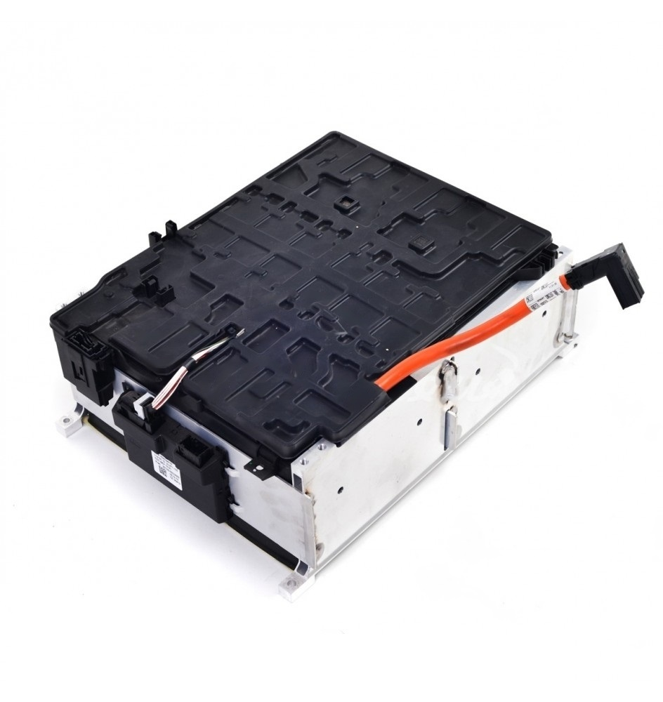
  <figcaption>BMW i3 Battery Module</figcaption>
</figure>

The BMW i3 battery modules are designed to be used with a chill plate on the bottom to dissipate excess heat.
The original battery pack routed the AC lines under each module.
Given that the batteries are relatively inexpensive and NMC chemistry has high [thermal stability](https://www.grepow.com/blog/nmc-vs-nca-battery-cell-what-is-the-difference.html), a simple glycol and water coolant loop could be routed through custom chill plates to a radiator instead. 
If the battery temperatures are shown to be too high, a heat pump could be retrofitted to chill the coolant, rather than route refrigerant lines through the battery pack.

Eight battery modules would easily fit in the Travelall split between two packs (432 lbs not including cooling) wired in series to make a 384v battery pack, but this would mean a total capacity of only 21.6 kWh, a little short of the 23.3 kWh target battery capacity [required](system_design.md#capacity).
The Nissan leaf battery pack was 384V, and it is possible that adding another module in series could result in a pack [voltage](https://www.diyelectriccar.com/threads/leaf-inverter-voltage-input-limits.206166/) higher than the Leaf inverter can handle.

<figure markdown="span">
  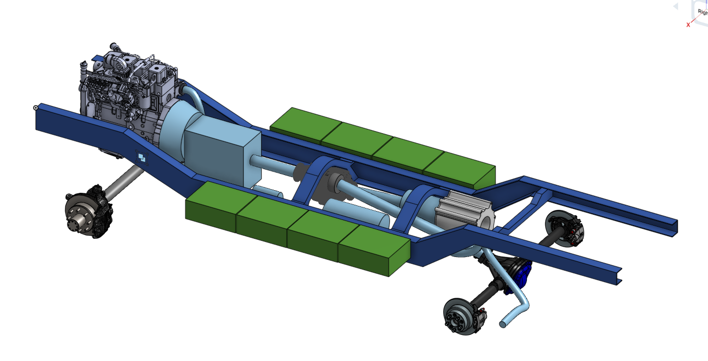
  <figcaption>8 BMW i3 Batteries</figcaption>
</figure>

It may be possible to fit 12 modules in 2-3 different packs wired up in a 2p6s configuration.
Fitting 12 modules into 2 packs leaves the most room for a gask tank, but may result in a battery pack hanging low to the ground behind the rear axle.
12 modules between 3 packs fit easily without hanging too low to the ground, but makes it more challenging to fit a gas tank, and requires more complicated high voltage wiring between packs.

<figure markdown="span">
  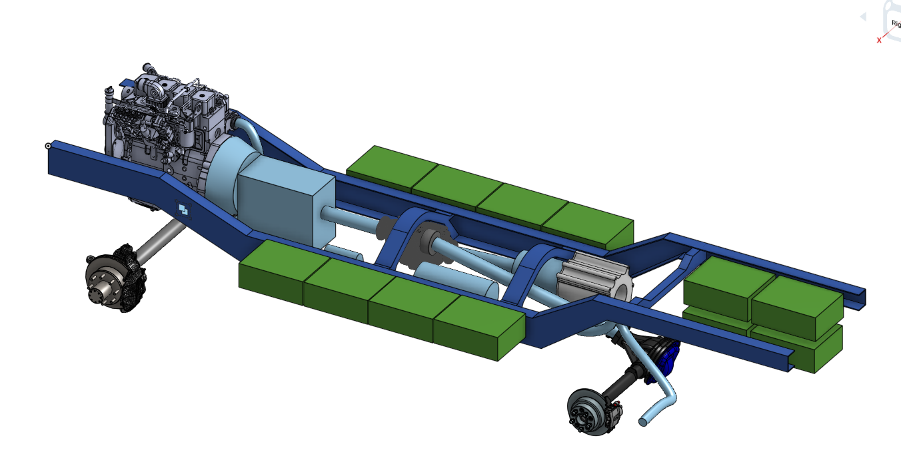
  <figcaption>12 BMW i3 Batteries</figcaption>
</figure>

#### BMS
The BMW i3 battery modules have a distributed BMS meaning each module has it's own BMS which contains taps to each parallel cell group to monitor voltage and taps to each cell to monitor temperature.
The module-level BMS also contains the hardware to do load balancing.
The SimpBMS / Vero BMS is a popular off the shelf option designed by EV conversion enthusiasts, and there are several members of EV forums working on their own BMS.

### Tesla S/X Battery Modules

#### Description

Tesla battery modules are probably the most modular battery used in production EVs.
Tesla battery modules have built in cooling tubes meaning there is no need to build in separate battery pack cooling.
This means it's easier to put batteries in a couple different locations since the pack design is simplified.
The Model S and X battery modules are smaller than the modules in the Model 3 which are much longer making the Model S/X batteries easier to package in a conversion application.
The same battery modules were used (I think) through the entire model S/W run (2012-2026).

| Module Parameter | Value |
| --------- | ----- |
| Voltage | 24 V |
| Capacity | 5.3 kWh |
| Dimensions | 27" x 11.8125" x 3" |
| Weight | 56.5 lbs |
| Approx. Cost | $1400  from [greentec](https://greentecauto.com/hybrid-battery/repurposed-batteries/energy/tesla-model-s-nca-24v-233ah-5-3kwh-battery-module/) |
| Thermal Management | Active (at module level) |
| BMS | Distributed |
| Chemistry | NCA |

<figure markdown="span">
  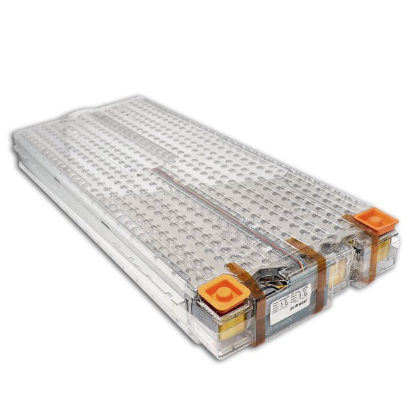
  <figcaption>Tesla Model S/X Battery Module</figcaption>
</figure>

The main challenge with using Tesla S/X batteries is that they are low voltage relative to their capacity.
To make a battery pack with high enough voltage to power a Nissan Leaf motor at low SOC an absolute minimum of 10 modules is required with 12 or more being preferred.
The result is a very high capacity and expensive battery pack.
There is no in-between.

Tesla battery modules use NCA chemistry which has fantastic energy density.
A 12 module pack of S/X modules would weigh around 672 lbs and have a nominal capacity of 63.6 kWh.
This is 89% higher power density compared to BMW i3 batteries even without including the cooling plates required for i3 batteries.
However, NCA batteries are more prone to degradation than the NMC batteries used in BMW i3s and Nissan Leafs. 
But because the energy density is so much higher it is likely that even with degradation the Tesla modules will offer more capacity than alternatives.

<figure markdown="span">
  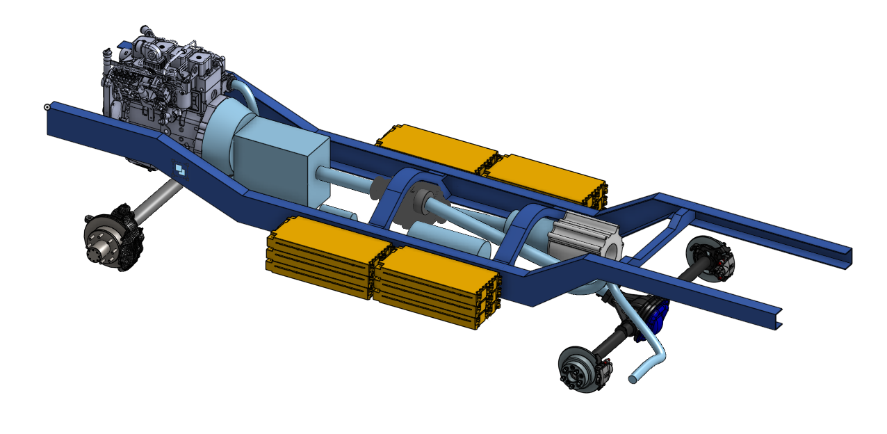
  <figcaption>12 Tesla Model S/X Battery Modules</figcaption>
</figure>

The battery modules are expensive at ~$1400 USD from greentec or EV West which have warranties and / or track the mileage of the vehicle they were removed from.
However, they are available at 25-50% of this price from other retailers or from ebay without warranty.
Additional testing would be prudent if ordering from one of these sources.

#### BMS
Similar to the BMW i3 batteries the Tesla S/X modules use a distributed BMS.
The same BMS options mentioned for the BMW i3 work for the Tesla and may even be easier to integrate since the EV conversion community had originally designed them with the Tesla modules in mind.

### 2012-2014 Rav 4 EV Batttery

#### Description

2012-2014 Rav 4 EV batteries were made by Tesla using the same 18650 cells and integrated liquid cooling loop as the Model S/X but reconfigured into two differently sized modules for packaging.
They are very similar to the S/X modules and notably have a higher voltage.
One downside of the Rav4 batteries is that the second generation Rav4 EV was made for 3 years only and only in California with [fewer than 2500](https://en.wikipedia.org/wiki/Toyota_RAV4_EV) being made which means that there are fewer used batteries available and more likely with higher degradation than S/X batteries due to their age.

| Small Module | Value |
| --------- | ----- |
| Voltage | 18.5 V |
| Capacity | 2.6 kWh |
| Configuration | 5s48p |
| Dimensions | 23" x 10.25" x 3" |
| Weight | 35 lbs |
| Approx. Cost | $165  from [greentec](https://greentecauto.com/hybrid-battery/repurposed-batteries/energy/toyota-rav4-tesla-nca-18v-124ah-battery-module/) |
| Thermal Management | Active (at module level) |
| BMS | Distributed |
| Chemistry | NCA |

<figure markdown="span">
  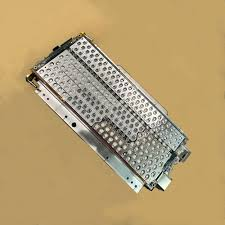
  <figcaption>Rav4 EV 18V Battery Module</figcaption>
</figure>

| Large Module | Value |
| --------- | ----- |
| Voltage | 44 V |
| Capacity | 5.5 kWh |
| Configuration | 12s48p |
| Dimensions | 36" x 11.8125" x 3" |
| Weight | 75 lbs |
| Approx. Cost | $1230  from [greentec](https://greentecauto.com/hybrid-battery/repurposed-batteries/energy/toyota-rav4-tesla-nca-44v-124ah-5-5kwh-battery-module/) |
| Thermal Management | Active (at module level) |
| BMS | Distributed |
| Chemistry | NCA |

<figure markdown="span">
  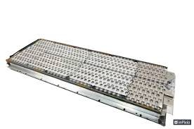
  <figcaption>Rav4 EV 44V Battery Module</figcaption>
</figure>

These batteries are relatively affordable compared to Tesla Modules.
The higher voltage per module makes it easier to make a sufficiently high voltage battery pack compared to using Model S/X modules.
One small and one large module could be layed end to end to make a single effective 17s48p module 59" long and 9 kWh, 110 lbs, 63V.
That's 5" longer than two S/X modules end to end which would be 10.6 kWh, 112 lbs, 48V.
The RAV 4 modules have slightly less energy density than the S/X modules but it is an affordable option to create a sufficiently high voltage battery pack with excellent capacity.
Three of these large & small modules on each side would result in a 378V pack (very good), 54 kWh pack (very good), 660 lbs in modules alone (heavy).

<figure markdown="span">
  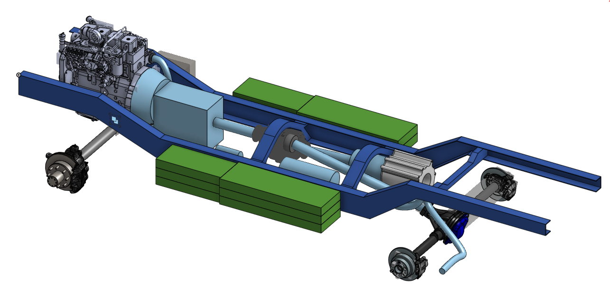
  <figcaption>Rav4 EV Battery Modules</figcaption>
</figure>

#### BMS
The same BMS options for the BMW i3 and Tesla Model S/X modules work for the Rav4 EV modules.

### Selection

The following decision matrix summarizes the battery options using the following characteristics based on placement options in a Travelall.

**Cost** - How expensive is it to buy enough modules for an entire pack

**Capacity** - Does the battery pack fall short of, meet, or exceed the minimum battery capacity

**Weight** - How light can the battery pack be

**BMS** - How straightforward is it to integrate a BMS.
This combines BMS cost and ease of integration

**Cooling** - How easy is it to implement battery pack thermal management

**Degradation** - How prone the batteries are to degradation and / or how likely are used batteries to be degraded

The categories are weighted by how significant each category is to the functional and non-functional requirements for the project.
The Nissan Leaf battery module is chosen as a datum, and the other modules are rated relative to it.
The range of each rating is normalized to a range of -1 to -1 using as few graduations as practical.

|  | Weighting | Nissan Leaf | BMW i3 | Tesla S/X | Toyota Rav4 EV |
|--|--|--|--|--|--|
| Cost        | 2.0 | 0 | -0.5 | -1  | -0.5 |
| Capacity    | 2.0 | 0 |  0   | +1  | +1   |
| BMS         | 1.0 | 0 | +1   | +1  | +1   |
| Cooling     | 1.0 | 0 | +0.5 | +1  | +1   |
| Weight      | 0.5 | 0 |  0   | -1  | -1   |
| Degradation | 1.0 | 0 |  1   | 0.5 |  0   |
| Total       |     | 0 |  1.5 | 2.0 |  2.5 |

The Rav4 battery appears to be the best choice primarily due to the large capacity and low price.
The potential for battery degradation is a serious concern and in reality the decision may be made between the Tesla and Rav4 modules depending on which fits best in the donor body, since the Tesla modules have greater capacity.

#### Summary

The battery used for this project will either be the Toyota Rav4 EV batteries or the Tesla Model S/X batteries.
Both batteries are similar in size, cooling, and BMS integration allowing the specific module to be chosen at a later date.

## Pack Design

The main focus of the battery pack design is safety.
Safety primarily means preventing harm to somebody using or working on the vehicle but it also means preventing or limiting damage to other components in the event of a failure.

Because of the challenge of fitting a combustion engine and electric drivetrain in the vehicle the battery had to be split into two packs in series in order to have a pack large enough to meet the requirements.
The pack with the lower voltage of the two packs will be called **pack 1** and the pack with the higher voltage will be called **pack 2**.

### Electrical

#### Safety

To protect against electrocution each high voltage line connected to each battery pack will have normally open (NO) contactors inside the battery pack so that when the vehicle is parked there will be no source of high voltage outside of the battery.
In addition to the contactors, manual service disconnects will be placed adjacent to each battery as a redundant protective measure against high voltage for when the high voltage system needs to be serviced.
Furthermore, in accordance with The US Federal Motor Vehicle Safety Standard all high voltage conductors will be IPXXD protected if inside the passenger compartment or IPXXB protected otherwise.

To protect against hazards cause by short circuits a fuse will be added to each battery pack which will prevent discharge exceeding the nominal discharge rate.

To ensure that the high voltage system remains isolated from the chassis a high voltage isolation module will be added as required by the [United States Federal Motor Vehicle Safety Standard](https://www.federalregister.gov/documents/2017/09/27/2017-20350/federal-motor-vehicle-safety-standards-electric-powered-vehicles-electrolyte-spillage-and-electrical).

#### Precharge

Because the inverter or other high voltage electronics may have a high level of capacitance a precharge resistor is necessary to reduce inrush current and protect the contactors from arcing and eventual damage.
Precharge resistors gradually allow the voltage from the battery to equalize on either side of a contactor before it closes.
It is only required to have a precharge resistor on the high voltage or low voltage of the combined battery pack.

For no particular reason the high voltage terminal of pack 2 will have a precharge resistor, although the low voltage terminal of pack 1 would also have worked.
There is no need to have a precharge resistor on the high voltage terminal of pack 1 or the low voltage terminal of pack 2 because the connection between the packs is a simple wire which has negligible capacitance which means contactor arcing is not a concern.

#### BMS

The SimpBMS, now called Vero BMS V2 will be used for the battery because it is relatively affordable and designed for use with distributed BMS systems like that used with the Tesla / Rav4 EV battery modules.
The Vero BMS communicates with the slave BMSs over CAN to handle battery balancing, monitor SOC, temperature etc.
The Vero BMS has native support for several current sensors and chargers.
Using the BMS with a non-supported charger may require the use of a CAN translation module.

<figure markdown="span">
  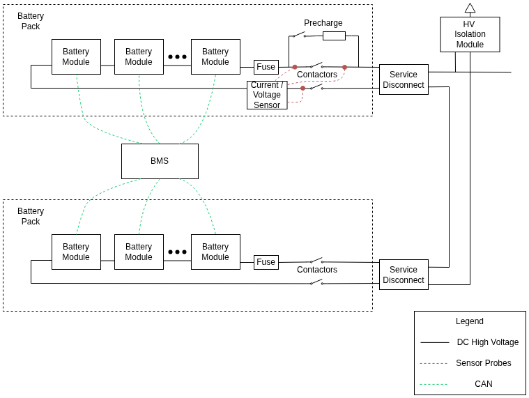
  <figcaption>Battery Block Diagram</figcaption>
</figure>

### Mechanical

#### Safety

The battery pack needs to be water-tight to prevent contamination which could contribute to the risk of internal short circuits.
Although the battery pack should be water-tight, it should have the ability to vent pressure.
In the event of thermal runaway pressure could build up in the pack which is a hazard.
To prevent this, both packs should have a pressure relief port.

Additionally, the pack needs to be impact resistant because it may be be exposed to road debris or potentially be deformed in a crash.
As an additional measure of protection, a thin layer of insulation should be placed between each battery module in the pack so that in the event of damage to the pack the chances of conductive surfaces coming into contact is reduced.

## Thermal Management

When a battery is too hot either during use or storage, it can shorten its lifespan and lead to an increased risk of thermal runaway.
When a battery is too cold, generally it is ok to discharge, although performance will be decreased, but charging should be avoided because of plating which worsens with lower temperatures and higher charging rates.

To maximize battery life and performance it should be kept between [20-30C](https://www.wiltsonenergy.com/EV-Battery-Thermal-Management.html) for normal operation
While level-3 charging some EVs heat their batteries above this range to improve charging speed and reduce plating in the battery which shortens its lifespan.

Cooling for the battery is done at the module level.
The modules each have coolant tubes which circulates an EV specific non-conductive coolant to heat or cool the batteries as desired.
The selected motor and inverter are also liquid cooled.

There are many ways to implement a liquid cooling loop for the batteries and inverter.
The following are three proposed designs focusing on simplicity and prioritizing keeping the battery in the optimal temperature range.

### Passive Battery Cooling with Resistive Heating

This solution has a shared coolant loop for the battery, motor, and inverter to minimize complexity.
There is an inline resistive coolant heater to quickly bring the battery into the optimal temperature range in cool weather and a radiator to shed heat to the surroundings.
The radiator can be bypassed with a three port valve when the coolant temperature is below the desired range.
Not pictured is the cabin heating which would have to use an independent heat source like a diesel fired heater.

This solution is extremely simple and cost effective however because cooling depends on there being a temperature differential with the surroundings this means it will not be possible for the battery to shed heat to the surroundings when the weather is hot.
This means that on 30C or higher days the battery may have to be derated to avoid overheating and battery degradation would be increased if used consistently in these conditions.

<figure markdown="span">
  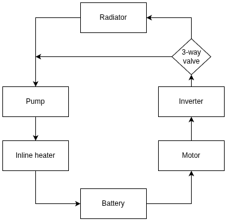
  <figcaption>Passive Battery Cooling with Resistive Heating</figcaption>
</figure>

### Active Battery Heating and Cooling

Another solution is to use a heat pump with a heat exchanger to add or remove heat from the battery cooling loop.
Not pictured is a reversing valve for the heat pump.
In addition to the heat pump, there is also a radiator to more efficiently shed heat without requiring running the heat pump compressor, and a bypass.
The resistive heater would only be used in extremely cold conditions because in mild weather the heat pump is more efficient.
The heat pump would also be able to cool the coolant loop when ambient conditions are too hot for the radiator to keep the coolant in the optimal temperature range.

As with the first solution, cabin heating would be done independently.

<figure markdown="span">
  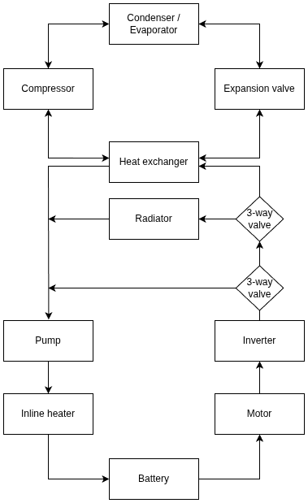
  <figcaption>Active Battery Heating and Cooling</figcaption>
</figure>

### Active Battery and Cabin Heating and Cooling

This approach is similar to the previous approach except it allows the heat pump to be used for cabin climate control in addition to battery temperature control.
To reduce complexity, it is not possible to use the heat pump to heat the cabin while cooling the battery or vice versa.
The cabin and battery must both be either cooling or heating when relying on the heat pump.
Because humans and batteries are comfortable at similar temperatures this limitation will not impact passenger comfort.

<figure markdown="span">
  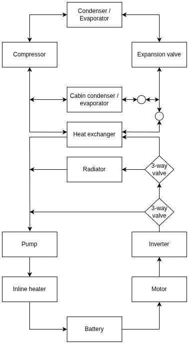
  <figcaption>Active Battery and Cabin Heating and Cooling</figcaption>
</figure>

### Selection
Active battery and cabin heating and cooling combines the ability to keep the battery at the optimal temperature in all but the hottest conditions while providing the most passenger comfort for only slightly more complexity than active heating and cooling of the battery only.
However, passive cooling is by far the cheapest option and realistically there would be few days a year where the ambient temperature is too hot for passive cooling.
In addition, both active cooling / heating options build on top of the passive cooling design so it is possible to upgrade in the future to use active cooling without additional cost relative to using active cooling from the start.

Therefore, passive cooling will be used for this project.

## Charging
[SAE J1772](https://en.wikipedia.org/wiki/Charging_station) defines 4 levels of charging.

| Level      | Current Limit | Voltage Limit | Power Limit |
|------------|---------------|---------------|-------------|
| AC Level 1 |       16      |      120      |       1.92  |
| AC Level 2 |       80      |      240      |      19.2   |
| DC Level 1 |       80      |     1000      |      80     |
| DC Level 2 |      400      |     1000      |     400     |

The most common charging connector in North America is the [NACS](https://en.wikipedia.org/wiki/North_American_Charging_Standard) (North American Charging System).
The NACS charger can be used with all SAE J1772 charging levels.

<figure markdown="span">
  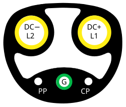
  <figcaption>NACS Pinout</figcaption>
</figure>

Another option besides NACS chargers are CCS chargers.
CCS chargers are more commonly used outside North America but are still relatively common inside North America.
CCS and NACS chargers are compatible with the use of adapters because they share the same underlying [ISO 15118](https://en.wikipedia.org/wiki/ISO_15118) communication protocol.
Because CCS and NACS chargers share the same communication protocol and the main difference is the charge port, the more common NACS charger will be used.

<figure markdown="span">
  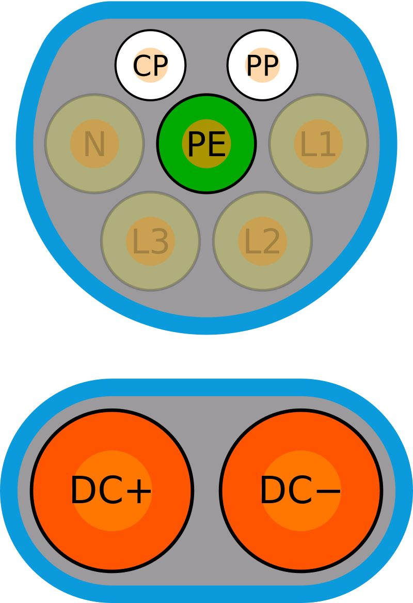
  <figcaption>CCS Pinout</figcaption>
</figure>

For the purpose of this project AC level 1 charging is sufficient.
Higher levels of charging would be nice but are not necessary and can always be upgraded later.

### On Board Charger

In order to support AC charging an on board charger is required.
The on board charger converts AC power at standard household voltages to DC voltage at the level required for charging the pack.
Some onboard chargers are integrated with high to low voltage DC-DC converters for charging the 12V battery.

There are many on board chargers (OBC) which will work
Some options are outlined below:

#### Thunderstruck TSM2500

- Cost ~555 USD for the CAN enabled version, plus charge controller (~270 USD).
- Max power 3kW
- Native support with Vero BMS
- No built in DC-DC converter

#### Elcon 6.6kW HK-LF-312-20 CAN Bus Charger

- Cost ~1600 USD. Charge controller sold separately ~320 USD
- Max power 6.6 kW with 120V input and 3.3 kW at 120V input
- Native support with vero BMS I think
- No built in DC-DC converter

#### AEM EV Combined Charging Unit (CCU)

- Cost ~2536 USD including charge controller
- Max power 6.6 kW
 -No native support vero BMS
- Built in 2.5 kW DC-DC converter

#### Tesla Model 3 PCS

- Cost 100-500 USD used
- Requires open source controller (300 USD)
- Requires additional charge controller to use with NACs or CCS charger (~100 USD plus significant effort for integration)
- Max power 11 kW
- Built in DC-DC converter

There have been some people who have succesfully used the Tesla Model 3 PCS (Power Conversion System) which can provide up to 11 kW of charging power and also provides DC-DC conversion. 
An open source PCS controller is available from [evbmw.com](https://evbmw.com/index.php/evbmw-webshop/tesla-boards) which replaces the PCS's internal control board for ~$300 USD.
The PCS still needs a charge controller which can communicate with the EVSE
The BMW LIM charge controller has been succesfully used as a CCS compatible charge controller.

The LIM is available for under $100 USD used and the Model 3 PCS is available for $100-500 USD used making this an extremely affordable option with the best performance.
However, this option is more experimental and would involve some reverse engineering, unlike the other options which are more off the shelf and have documentation available.
Although it would be nice to get this working, the project scope is already huge and it might be better to do as an upgrade later.
