# Powertrain Module Design

This document contains the detailed design of the powertrain module.
The purpose is to provide concrete information for the powertrain module and act as a decision log, containing not only the final design, but an explanation of why the design was chosen over alternatives.
The scope of the design is limited to parts selection for major components like the engine, transmissions, and electric motor and rough placement in the chassis.
Details like mounting brackets, driveshafts, exhaust, wiring, and fuel lines are left unspecified outside of rough location because not enough information is available to model them accurately.
Once the donor Travelall body is acquired a more detailed design can be created.

## Engine Selection

The combustion engine is the largest part of the drivetrain which means it has the least flexibility on placement.
Realistically, it has to stay in the original location at the front of the vehicle.
Engine selection is also one of the most subjective aspects of this project which has implications on other aspects like the donor vehicle body.
There are many engines which are efficient, small, and light enough to work for this project.
The final selection may be determined by factors other than the project requirements like how cool I think they are or whether they are suitable for running on vegetable oil which I'm interested in doing in the future.

### Deutz 912

The [Deutz 912](https://www.deutzusa.com/fileadmin/contents/com/engines/datasheets/en/FL_912_Marine_EN.pdf) series are air cooled direct-injection diesel engines with individually replacable cylinder liners or 'jugs'.
It is known for being extremely long lasting and fuel efficient.
It is available in 3-6 cylinder versions which share the same cylinder heads but different crankcases and crankshafts.
The 4 cylinder version (F4L912) produces 51 kW (68 hp) which is sufficient for this project.
It weighs 661 lbs dry. It does not need a radiator or coolant which gives this engine a weight and packaging advantage over similarly sized liquid cooled engines.
However, without a water cooling jacket dampening combustion vibration, it is commonly reported that Deutz 912 engines are noisy.
Additionally, when running vegetable oil as fuel, the engine coolant loop is often used to preheat the fuel to improve combustion, meaning a vegetable oil conversion on the Deutz 912 would need an external heater.

<figure markdown="span">
  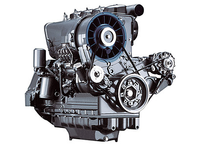
  <figcaption>Deutz F4L912</figcaption>
</figure>

<figure markdown="span">
  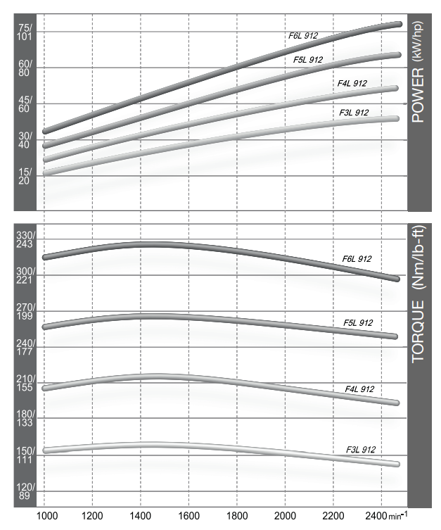
  <figcaption>Deutz 912 Series HP and Torque Curve</figcaption>
</figure>

### Cummins 4BT

The Cummins 4BT is a water cooled 4 cylinder, 3.9L directed-injection diesel engine.
It was produced from 1983-1997 in North America but production has continued in other parts of the world.
It produces up to 105 hp in stock form but is commonly modified to produce much more.
It does not have replaceable cylinder liners, although it is commonly bored and sleeved during rebuilds but it has to be mentioned regardless due to its popularity in engine swaps. 
The 4BT weighs approximately 750 lbs.
The 4BT is commonly reported to be noisy, but it is most likely quieter than the Deutz 912.

<figure markdown="span">
  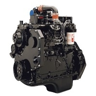
  <figcaption>Cummins 4BT</figcaption>
</figure>

<figure markdown="span">
  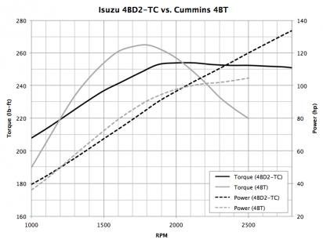
  <figcaption>Cummins 4BT HP and Torque Curve</figcaption>
</figure>

### Perkins 4.236

The Perkins 4.236 is a water cooled 4 cylinder, 236 cubic inch (3.9L) directed-injected diesel engine.
It was produced from 1964 and had a production run of over 30 years with over 2 million being made.
It has replacable dry cylinder liners.
It can produce around 63 kW (86 hp).
It is surprisingly difficult to find information on the weight, with estimates ranging from 580 lbs to over 1200 lbs.
The figures on the upper end of that range are likely referring to entire gen-sets or auxilary equipment.
The actual dry weight of the engine is likely on the lower end since it is generally accepted that the Perkins 4.236 is slightly lighter, and smaller than the Cummins 4BT.
The Perkins 4.236 is a noisier engine than most passenger car engines, but by many accounts it is quieter than the 4BT or Deutz 912.

<figure markdown="span">
  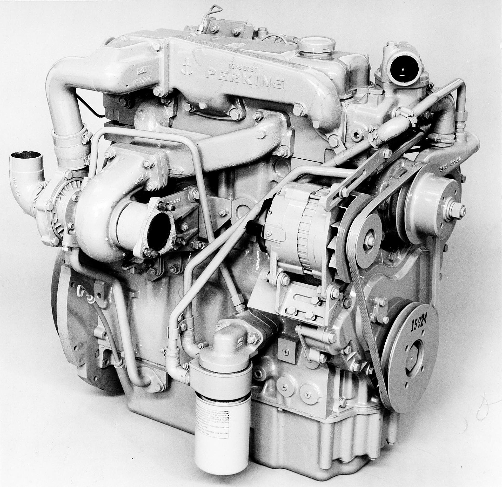
  <figcaption>Perkins 4.236</figcaption>
</figure>

<figure markdown="span">
  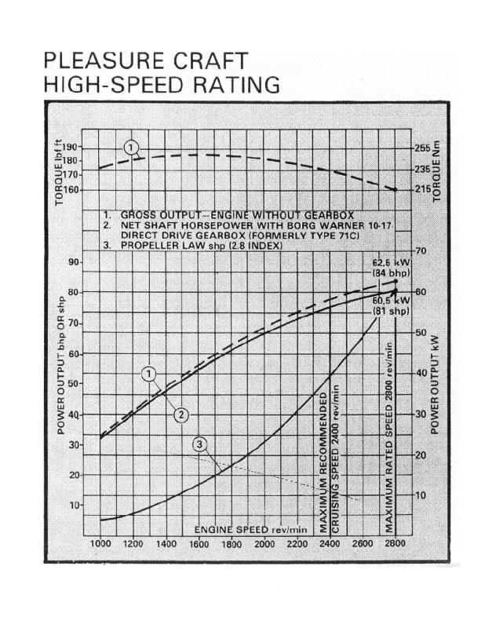
  <figcaption>Perkins 4.236 HP and Torque Curve</figcaption>
</figure>

### Summary

Any of the engines mentioned above would make fine powerplants for a heavy-duty hybrid conversion.
They are all renowned for their efficiency and durability, and I think they are all cool in different ways.
I think the Deutz 912 series engines are extremely cool because of the replacable cylinder jugs and being air cooled.
But it does make it more difficult to do a vegetable oil conversion in the future and I don't want to eliminate that possibility.
Ultimately, the Perkins 4.236 is the best choice. It is the smallest and quietest of all the options considered which will make it easier to meet the maximum cabin noise requirement, and to not exceed axle weight ratings.
Being liquid cooled it is the most straightforward to convert to run on vegetable oil eventually.

## Transmission Selection

The project will use a manual transmission.
Although an automatic transmission will probably make for a more seamless user experience, it just doesn't give me the same level of satisfaction to use an automatic even though it would be a practical decision and allow other people to drive the vehicle easier.
Even though the decision is not based in objectivity, what is the point of doing a DIY hybrid conversion without enjoying the process (primary stakeholder satisfaction)?

### New Venture Gear 4500 (NV4500)

The [NV4500](https://www.novak-adapt.com/knowledge/transmissions/manual/nv4500.html) is a 5 speed manual transmission used in GM and Dodge trucks in the 1990s and 2000s.
It is available with a wide or narrow gear ratio spread.
The narrow gear ratio spread will work better with the low RPM of the Perkins 4.236 so that each upshift doesn't require revving to redline only to lug it in the next gear.
The ratios for the narrow gears are as follows, along with the percent decrease in ratio from the previous gear.

| Gear | Ratio | Percent Decrease from Previous Gear
| --- | --- | --- |
| 1st | 5.61 | - |
| 2nd | 3.04 | 46% |
| 3rd | 1.67 | 45% |
| 4th | 1 | 40% |
| 5th | 0.74 | 26% |
| Reverse | 5.61 | - |

The NV4500 weighs around 195 lbs, and is 18.9" long.
The NV4500 has a separate bell housing which makes it easier to attach to different engines.
The NV4500 is rated for an input torque of [460 ft-lbs](https://4btengines.com/how-to-pick-the-right-transmission-for-your-4bt-cummins/?srsltid=AfmBOoopXrOEafVLXl0oa4Ln5MF7Tm1M9lwuARPaK-XaYYUYsaXTQq8p).

### Ford ZF-5

The [ZF 5](https://www.dieselhub.com/transmission/zf-5-speed.html) is a 5 speed manual transmission used in Ford diesel trucks from 1987 to 1997.
The ZF 5 has a bellhousing integrated into the transmission casting making it challenging to use without a Ford engine and it will not be considered for this project.

### Aisin AX-15

The Aisin [AX-15](https://4btengines.com/how-to-pick-the-right-transmission-for-your-4bt-cummins/?srsltid=AfmBOoopXrOEafVLXl0oa4Ln5MF7Tm1M9lwuARPaK-XaYYUYsaXTQq8p) transmission is a 5 speed manual transmission used in Jeeps and the Dodge Dakota from 1989 to 1999.
It has a separate bellhousing like the NV4500 making is easy to use with other engines with a custom bellhousing adapter.
The ratios for the gears are as follows, along with the percent decrease in ratio from the previous gear.

| Gear | Ratio | Percent Decrease from Previous Gear
| :-: | :-: | :-: |
| 1st | 3.83 | - |
| 2nd | 2.33 | 39% |
| 3rd | 1.44 | 38% |
| 4th | 1 | 31% |
| 5th | 0.79 | 21% |
| Reverse | 4.22 | - |

The AX-15 is light at only [88 lbs dry](https://www.jeepforum.com/threads/ax-15-weighs-how-much.632462/), without a bellhousing.
The AX-15 is rated for an input torque of 300 ft-lbs.

### Decision Criteria

The AX-15 is a promising option due to the much lighter weight than the NV4500. The main concern is the taller first gear compared to the NV4500. The high weight of a Travelall with the relatively low torque of the Perkins 4.236 risks not being able to climb the steeper hills of San Francisco if the battery is dead.

The steepest street in San Francisco is Bradford Street at at 41% grade ($\arctan(0.41) = 22.29 ^{\circ}$).
Assuming the travelall weighs 6000 lbs or 2700 kg (batteries will increase the weight beyond stock) it would take $2700 kg * 9.81m/s^2 \times \sin(22.29^{\circ}) = 10046 N$ of force to go up the hill.
Assuming 32" diameter tires the following table shows the maximum traction force produced in first gear with several rear differential ratios assuming no drivetrain losses.
Even with 4.10 gearing in the differential, which would result in high RPMs on the highway and worse fuel economy, the Travelall would struggle to move up the hill with the AX-15.

| Differential Ratio | Force (lbf) | Force (N) |
| :-: | :-: | :-: |
| 3.07 | 1,631.44 | 7,256.99 |
| 3.54 | 1,881.20 | 8,368.00 |
| 3.73 | 1,982.17 | 8,817.13 |
| 4.10 | 2,178.79 | 9,691.75 |

The following table shows the force produced by the NV4500 in first gear.

| Differential Ratio | Force (lbf) | Force (N) |
| :-: | :-: | :-: |
| 3.07 | 2,389.6 | 10,629.7 |
| 3.54 | 2,755.5 | 12,257.0 |
| 3.73 | 2,903.4 | 12,914.9 |
| 4.10 | 3,191.4 | 14,196.0 |

With the NV4500 it would be possible to make it up Bradford St. with all available differential ratios. For that reason, the NV4500 will be used for this project despite its weight.

### Summary

The NV4500 transmission will be used behind the combustion engine because of the tall overdrive gear, and the low first gear that is able to get the Travelall up steep San Francisco hills.

## Drivetrain Layout

The IH Travelall was available in rear wheel drive and all wheel drive models.
The all wheel drive model is shown below.

<figure markdown="span">
  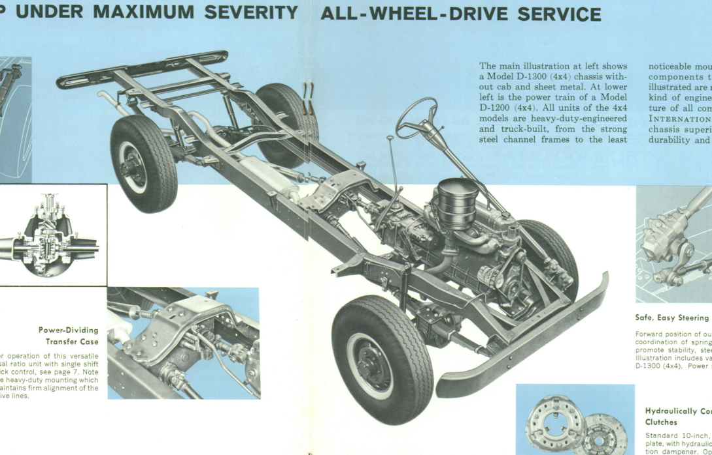
  <figcaption>Stock 4WD Travelall Drivetrain</figcaption>
</figure>

The same type of transfer case used in the all wheel drive model can be used to tie an electric motor to a combustion engine so either can provide power to the wheels.
The transfer case is already rated to handle many times more torque than any EV motor today, although a separate gear reduction box will be required to drop the motor RPM down enough to tie into the rear driveshaft.
Some investigation was done into obtaining other gear splitter / hybrid gearboxes but they cost upwards of $10,000 compared to repurposing automotive gearboxes which can be obtained used for several hundred dollars, or may already be included in the donor vehicle.

By combining information from various sources an approximate model of the Travelall frame and drivetrain was created for the purpose of determining motor placement.

<figure markdown="span">
  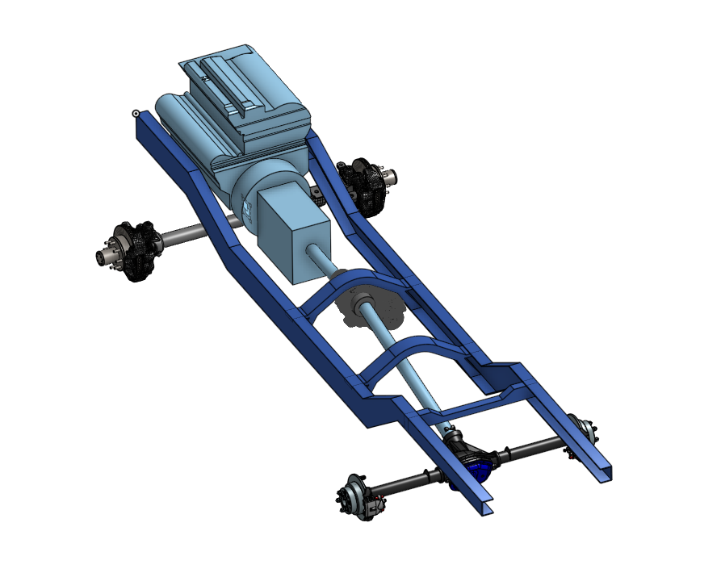
  <figcaption>Travelall AWD drivetrain CAD</figcaption>
</figure>

The following figure shows empty locations within the frame rails classified by feasibility for motor placement.
The green locations are ideal.
They allow placement of an electric motor connected to the transfer case by a short jackshaft with a nearly 0° u-joint angle and makes use of a space which cannot fit many battery modules.
The yellow locations are acceptable, if a motor cannot be made to fit in the green locations.
The yellow locations eat into prime real-estate for a large battery pack.
It may be required to modify crossmembers to make room for the jackshaft between the transfer case and motor.
The red locations near the transmission are not suitable because it is too small to fit an electric motor capable of propelling a Travelall and a reduction gearbox.
It might be possible fit a motor if the transfer case is moved back, but this increases the angle of the rear driveshaft between the transfer case and rear axle, reducing u-joint life and makes it more difficult to add a front driveshaft in the future to convert four wheel drive.

<figure markdown="span">
  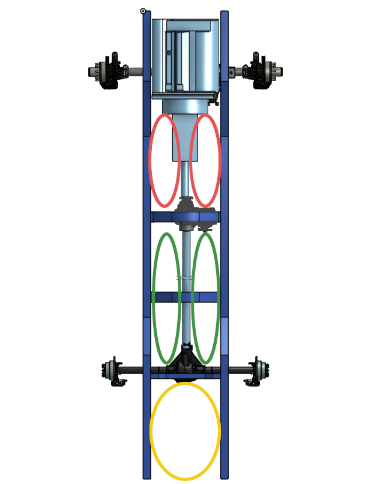
  <figcaption>Possible Motor Locations</figcaption>
</figure>

### Reduction Gearbox

The EV [TorqueBox](https://www.torquetrends.com/ev-torquebox) is the most commonly used EV reduction gearbox that is suitable for continuous operation at high RPM.
Is has an extensive catalog of adapters available for common electric motors.
Unfortunately it is expensive at ~$4000 USD, but there are limited options for gearboxes that are designed for high RPM operation.
Common low cost alternative are using a manual transmission in first or second gear although this may lead to early failure of the transmission since the input shaft on most transmissions typically operates at much lower RPMs.
Regardless, using a manual transmission as a reduction box for the electric motor would make it challenging to fit the motor + gearbox combination between the frame rail and driveshaft so the torquebox will be used for this conversion.

<figure markdown="span">
  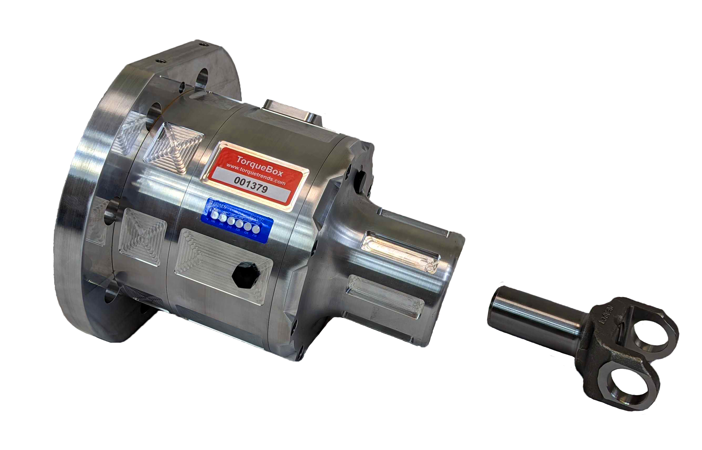
  <figcaption>Torque Trends EV TorqueBox</figcaption>
</figure>

### Electric Motor Selection

There are many electric [motors](https://openinverter.org/wiki/Motors) which are suitable for electric vehicle conversion. 
Although any type of motor can work in theory, modern EVs use AC synchronous motors, generally permanent magnent synchronous motors (PMSMs) due to their high efficiency and power density. 
Used motors from commercial electric vehicles are generally more cost effective compared to sourcing an industrial motor. Additionally, there are a limited number of EV conversion specific motors like the NetGain Hyper9 motor.

Many commercial EVs have motors where the motor casting is integrated into the transaxle.
The most useful motors will be those which can be separated from their transaxles such that they can fit alonside the rear driveshaft.
The most suitable options are the Nissan EM57 / EM61 and the NetGain Hyper9 motors. 

#### Nissan Leaf EM57 Motor

The [EM57](https://en.wikipedia.org/wiki/Nissan_EM_motor) is a PMSM motor used in the 2013-present nissan leaf is was capable of producing over 80 kW in all models (inverter limited).
It is extremely common, available for $1000 USD or less used, with a large knowledge base on EV forums.
There are several companies which make brackets and adapter plates for EV conversion.
It is capable of spinning at over 10,000 rpm and operates most efficiently at full load around 6000 rpm necessitating an additional gearbox.
The EM57 is liquid cooled with the inverter directly mounted to the motor, although it is possible to relocate the inverter.

<figure markdown="span">
  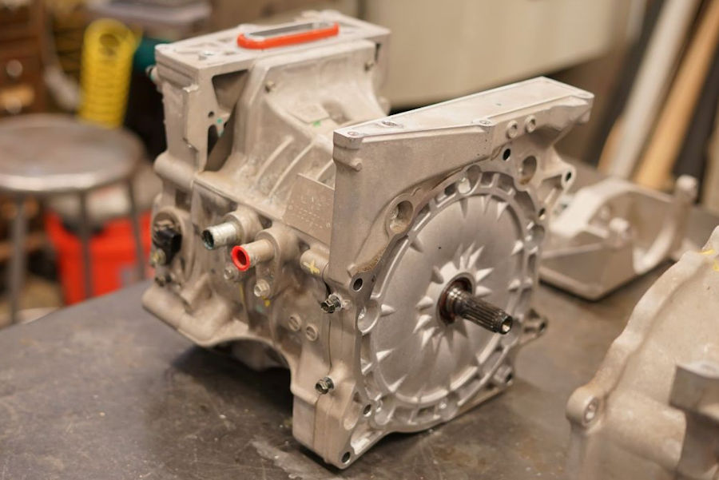
  <figcaption>EM57 Motor</figcaption>
</figure>

Unfortunately, the EM57 motor is difficult to fit between the frame rails and the rear driveshaft due to the inverter mounts and other mounting points on the motor casting which extend furthest from the motor centerpoint.
It may be possible to trim / cut off parts of the motor but it is unknown how much trimming is possible before puncturing the cooling jacket.
The lowest-risk placement option is to plan on placing the motor behind the rear axle connected by a long jackshaft. This may require crossmember modification and sacrificing some battery capacity.

<figure markdown="span">
  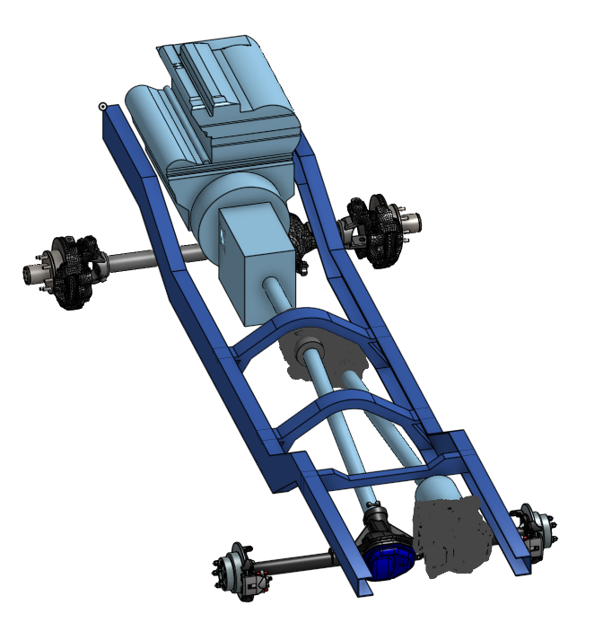
  <figcaption>Drivetrain Model with EM57</figcaption>
</figure>

<figure markdown="span">
  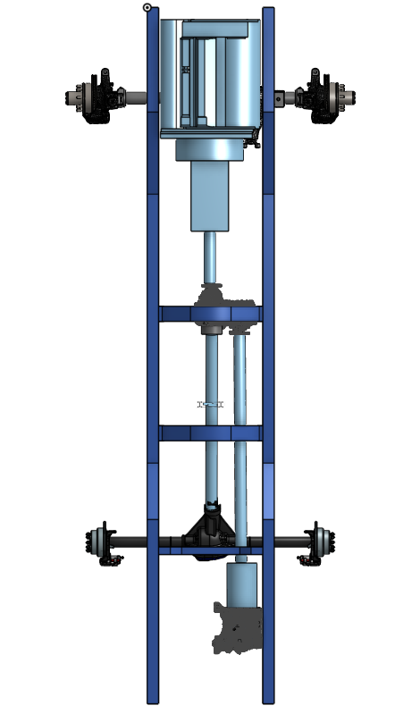
  <figcaption>Drivetrain Model with EM57 Top View</figcaption>
</figure>

#### Nissan Leaf EM61 Motor

The [EM61](https://en.wikipedia.org/wiki/Nissan_EM_motor) is a PMSM motor used in the first generation Nissan Leaf from 2010 to 2012 and was capable of producing 80 kW (inverter limited).
It is almost identical in specs to the EM57 motor, although slightly heavier, and also needs a reduction gearbox between the motor and the driveshaft.
The slimmer profile makes the EM61 easier in many cases to mount in EV conversion applications.
Is is common, although less so than the EM57 and similarly available for around $1000 USD used with a large community of knowledge and aftermarket support.

<figure markdown="span">
  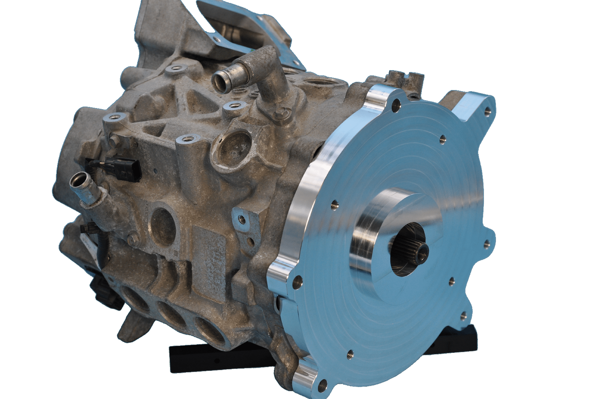
  <figcaption>EM61 Motor with Adapter Plate</figcaption>
</figure>

The EM61 motor is slimmer than the EM57 motor due to the lack of integrated inverter.
It is possible to fit the EM61 between the frame rail and driveshaft.

<figure markdown="span">
  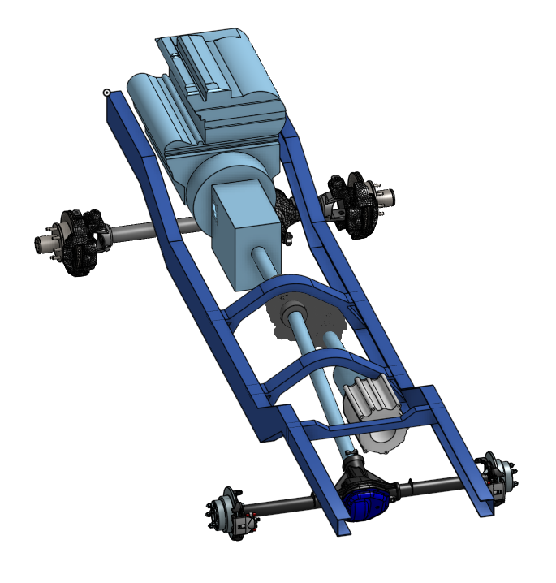
  <figcaption>Drivetrain Model with EM61</figcaption>
</figure>

<figure markdown="span">
  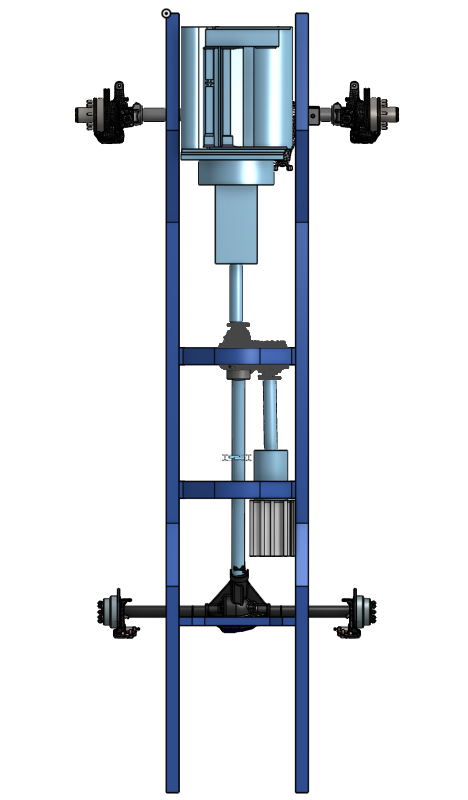
  <figcaption>Drivetrain Model with EM61 Top View</figcaption>
</figure>

#### NetGain Hyper9 Motor

The [NetGain HyPer 9](https://www.go-ev.com/motors-hyper.html) is a Synchronous Reluctance Internal Permanent Magnet (SRIPM) motor often used in EV conversion. It is  capable of producing 95 kW peak, and [41.5](https://www.go-ev.com/PDFs/HyPer_9_108V_Continuous_Performance.pdf) kW continuously.
The HyPer 9 is capable of operating at up to 8000 rpm and reaches full power at 4000+ RPM so will need a reduction gearbox.
Is is very compact with high availability of parts support.
It is available new for ~$3000 USD. Used, it is available for ~$2-3k USD.

<figure markdown="span">
  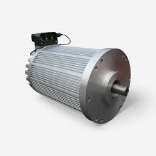
  <figcaption>HyPer9 Motor</figcaption>
</figure>

The HyPer 9 motor is even slimmer than the EM61 motor.
It is possible to fit the EM61 between the frame rail and driveshaft.

<figure markdown="span">
  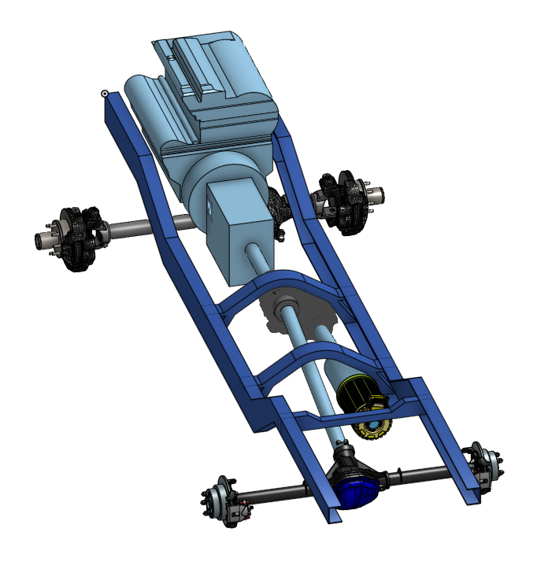
  <figcaption>Drivetrain Model with HyPer9</figcaption>
</figure>

<figure markdown="span">
  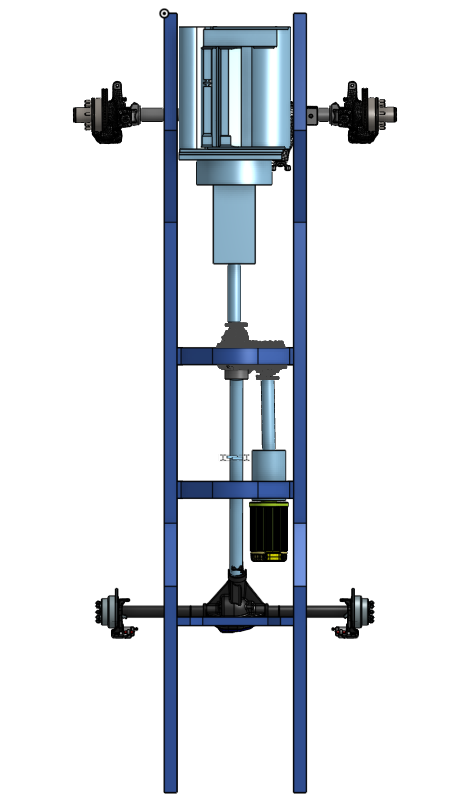
  <figcaption>Drivetrain Model with HyPer9 Top View</figcaption>
</figure>

#### Summary

The EM61 and Hyper9 motors are both able to fit in between the frame rail and the driveshaft which allows for the most efficient packaging and leaves the most room for a battery pack but EM61 is more powerful and cheaper, even when buying used.
The EM61 will be used for this project.
The Hyper9 will be a backup option if for an unforseen reason the EM61 is found to not be possible during implementation.

## Fuel Tank

The IH Travelall came from the factory with two fuel tank configurations. Some had a single large fuel tank between the frame rails behind the rear axle.
The other option was two smaller "saddle" fuel tanks mounted on the outside of the frame rail near the center of the vehicle.
Saddle tanks are better option for this project for two reasons. 
First, between the frame rails is a convenient location for a battery pack, keeping it close to the electric motor and more protected in the event of a collision.
Second, saddle tanks makes it easier in the future to run vegetable oil since there are separate tanks for oil and diesel.

Using two fuel tanks requires a mechanism for choosing which tank to draw from, or to transfer fuel from one tank to the other.
6 port fuel valves (3 supply lines and 3 return lines) are fairly common and often have the ability to switch the signal from two fuel level senders along with the fuel supply so that a single fuel guage can be used to display the fuel level of the currently selected tank.
[Pollak](https://www.pollakaftermarket.com/en/products/fuel-selector-valves/fuel-tank-selector-valves/3-port-and-6-port-fuel-valves) makes a fuel selector valve which is often recommended as a replacement for out of production or expensive OEM fuel selector valves.

<figure markdown="span">
  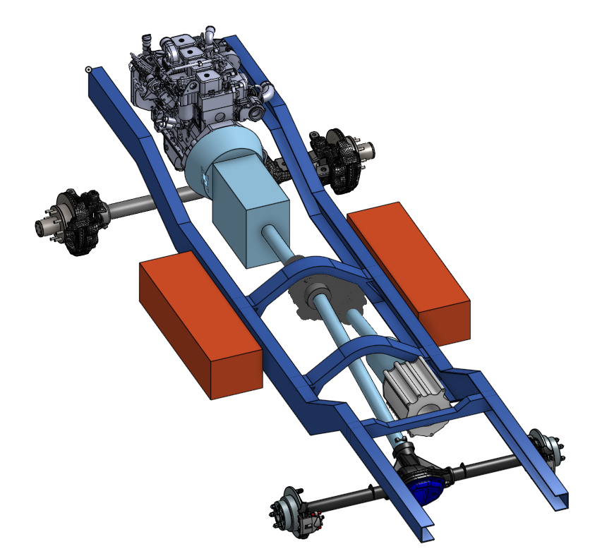
  <figcaption>Saddle Tanks</figcaption>
</figure>

## Exhaust

The most convenient path to route the exhaust is along the inside of the driver's side frame rail.
To avoid letting exhaust fumes in to open windows the exhaust will be routed over the rear axle so that the tailpipe is behind all doors and retractable windows.
The exhaust pipe will be directed to the outside of the frame once it clears the rear axle to give as much clearance to the battery as possible. In addition, heat shielding will be installed between the exhaust and the battery.
The Perkins 4.236 engine exhaust manifold is on the passenger side, so a crossover pipe will be required to direct the exhaust to the drivers side of the vehicle.
The crossover pipe will be located near the bellhousing between the engine and transmission.

<figure markdown="span">
  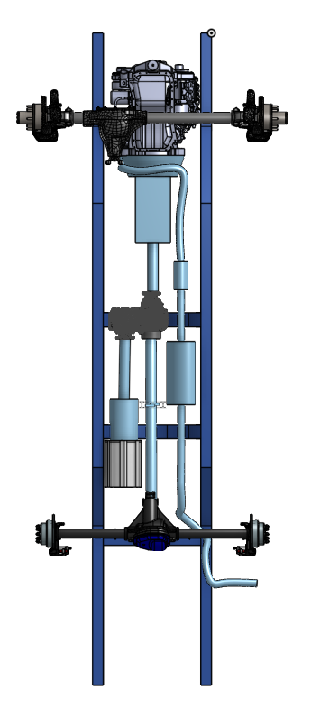
  <figcaption>Exhaust Bottom View</figcaption>
</figure>

<figure markdown="span">
  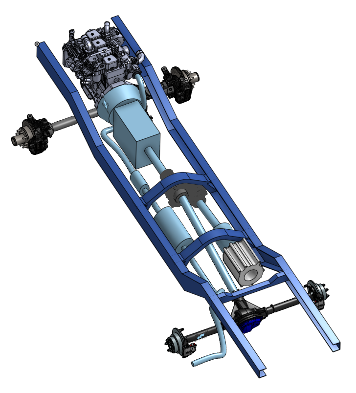
  <figcaption>Exhaust Ortho View</figcaption>
</figure>

## Controls
