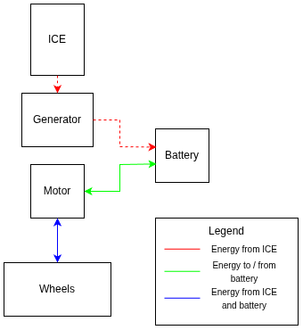
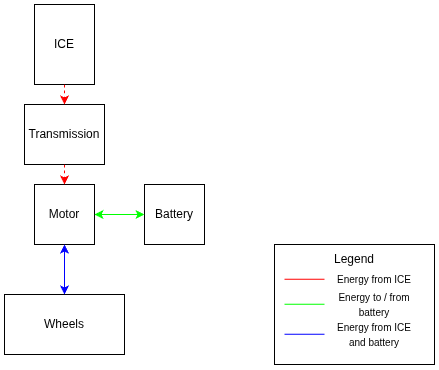
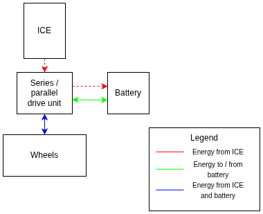
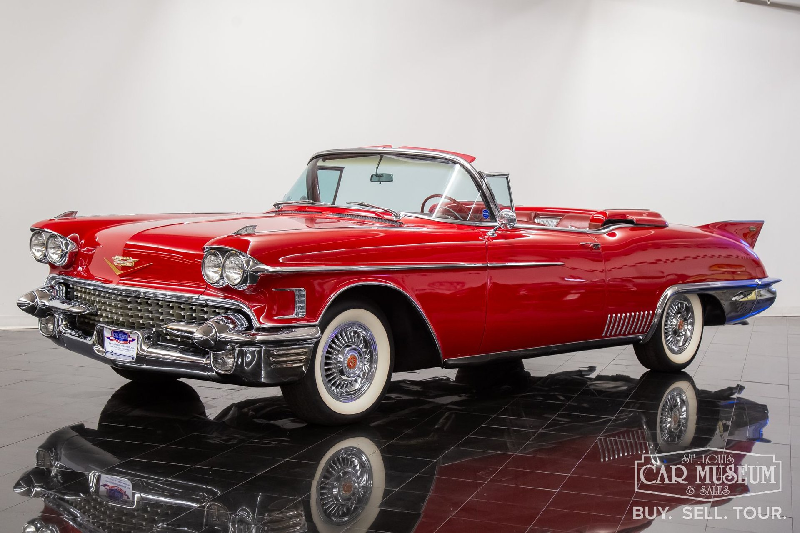
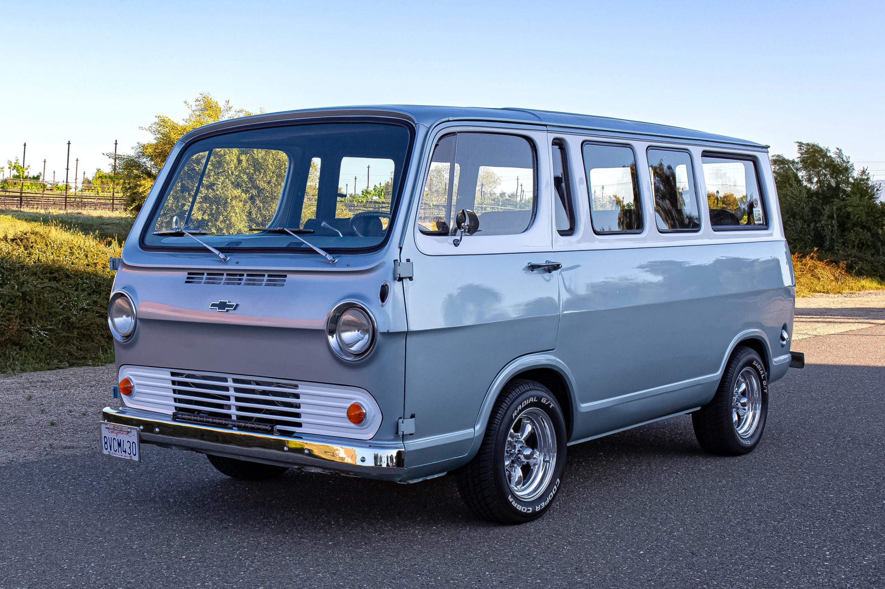
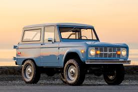
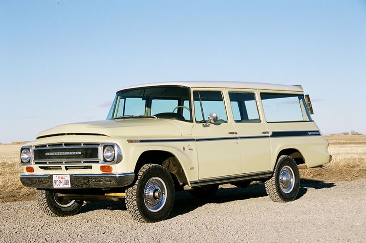
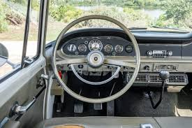
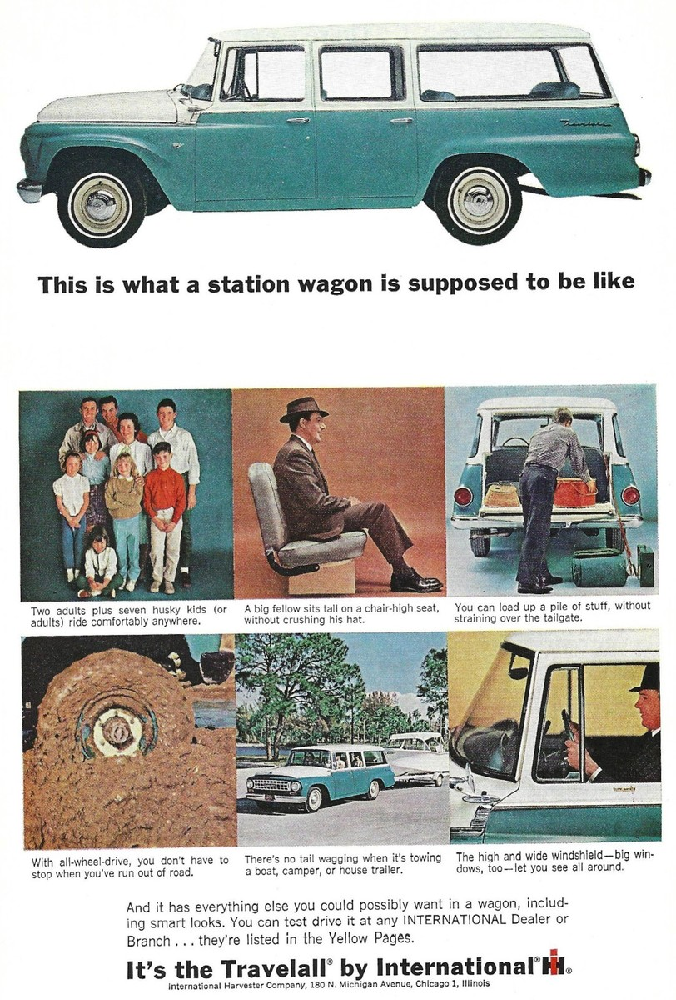
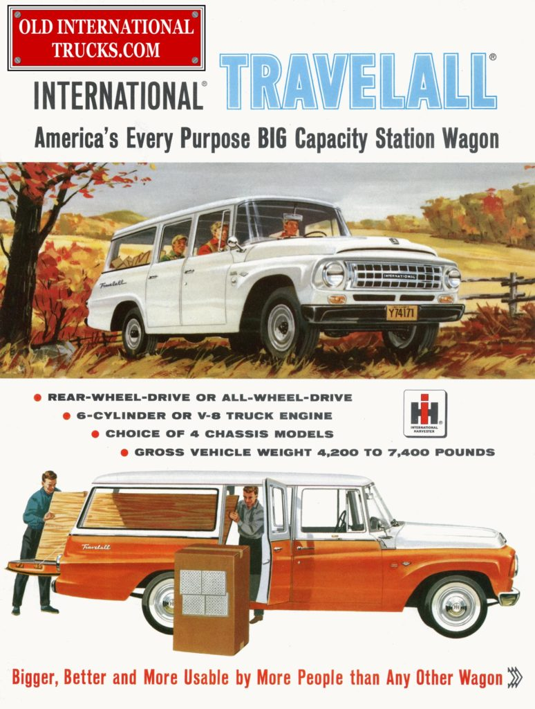

# System Design

This document exists to outline the high level design for the project.

## Drivetrain Architecture

There are many ways to implement a hybrid drivetrain depending on goals like cost, efficiency, power, packaging, or redundancy.

### Concepts

#### Series Hybrid

<figure markdown="span">
  
  <figcaption>Series Hybrid Energy Flow Diagram</figcaption>
</figure>

The series hybrid is simple and offers efficient packaging since it does not need a transmission. The battery + electric motor drives the vehicle and supports regenerative braking while the ICE and generator exist to keep the battery charged. As long as the ICE + generator are able to produce enough power to meet continuous power demands the vehicle can drive until the battery and fuel for the ICE is depleted. This architecture supports driving on battery power alone, or a hybrid of battery and ICE power.

The main drawbacks of the series hybrid is that two electric motors / inverters are needed and the efficiency during long highway drives is lower because mechanical energy from the ICE must be converted to electrical energy and then back to mechanical energy before reaching the wheels which is roughly a 10-20% efficiency penalty compared to using the mechanical energy directly (depending on motor efficiency)

#### Parallel Hybrid

<figure markdown="span">
  
  <figcaption>Parallel Hybrid Energy Flow Diagram</figcaption>
</figure>

Parallel hybrid drivetrains are highly efficient because they allow energy transfer to and from the wheels directly from the electric motor / battery while also allowing energy from the ICE to be transferred directly to the wheels. If there are no lubrication problems with driving the output shaft of the transmission while keeping the input shaft stationary, then this architecture supports driving under battery power only or with a hybrid of battery and ICE power.

To operate at peak efficiency the ICE / transmission, and motor must be chosen such that at the desired cruising speed the ICE and motor are both operating at their most efficient operating point since their speeds are coupled. It is possible to avoid this problem if you are using a CVT transmission.

The most significant drawback with this architecture is that it assumes that the electric motor can be placed in the middle of the drivetrain. The driveshaft of most ICE vehicles will be rotating at 2000-3000 RPM at highways speeds, however the radially wound Permanent Magnet Synchronous Motor (PMSM) motors will not reach peak efficiency or power until much higher rpms. Axially wound PMSM motors operate efficiently at low speeds but are much more expensive. This effectively means there are two options. 1. Use step up and step down gearboxs to fit a cheap used EV motor in the middle of a driveshaft which hurts packaging and increases cost significantly, or 2. Use a much more expensive axial flux PMSM motor which would eat up most of the project budget on the motors / inverters alone.

#### Redundant Parallel Hybrid

<figure markdown="span">
  
  <figcaption>Redundant Parallel Hybrid Energy Flow Diagram</figcaption>
</figure>

The redundant parallel hybrid is similar to the parallel hybrid except this architecture supports fully independent ICE and battery energy transfer pathways i.e. it is possible to drive on ICE power alone, battery power alone, or a hybrid of both energy sources. This would be a valuable characteristic for a home-built hybrid because it would minimize the odds of getting stranded due to equipment failure. Again, practically speaking a speed reducer is needed to couple the electric motor to the drivetrain, but in this case only the reducer is needed which are much more common and affordable.

#### Series - Parallel Hybrid

<figure markdown="span">
  
  <figcaption>Series Parallel Hybrid Energy Flow Diagram</figcaption>
</figure>

The series parallel hybrid, exemplified by the Toyota Prius (FWD) and Toyota LS600h (RWD or AWD), combines the series and parallel hybrid architectures to mitigate the downsides of both. Mechanical energy can be transmitted directly to the wheels while driving in a hybrid drive mode and it is also possible to drive on battery power alone. 

However, These drive units often use proprietary engine mount patterns and there is minimal documentation available for these drive units. For these reasons they are not popular in engine swaps or car modification which is reflected by the lack of aftermarket adapters to mate different engines to these drive units. Getting a custom adapter built increases the cost of implementing this architecture. In addition, there is not much support for rebuilding these drive units. Generally speaking, if one of the internal motors or gears were to fail, you would buy an entirely new drivetrain which doesn't sit well with me which is enough reason on its own to disqualify this architecture.

#### Concept Evaluation

The table below contains a comparison of the characteristics of each architecture.

|  | Series Hybrid | Parallel Hybrid | Redundant Parallel Hybrid | Series - Parallel Hybrid |
|----------|----------|----------|----------|----------|
| Efficiency | 🟥 | 🟨 | 🟨 | 🟩 |
| Reliability | 🟨 | 🟨 | 🟩 | 🟨 |
| Packaging | 🟩 | 🟨 | 🟨 | 🟩 |
| Cost | 🟨 | 🟥 | 🟨 | 🟨 |
| Power | 🟨 | 🟩 | 🟩 | 🟩 |
| Stakeholder satisfaction | 🟩 | 🟩 | 🟩 | 🟥 |

Based on this comparison it seems clear that the redundant parallel hybrid architecture is the best solution for this project. It is capable of driving on battery power alone, hybrid power, or ICE power alone which goes above the minimum requirements for this project.

## Vehicle Platform

The user requirements limit the body styles that are suitable for this project, especially the requirement to use a diesel engine with replaceable cylinder liners. These engines are generally heavy and large relative to the power they produce which necessitates a large and tall engine compartment and a large weight carrying capacity. Most vehicles that meet this criteria will be truck platforms. Most antique cars which I find appealing are characterized by long low hoods which unfortunately excludes them for this project but I have made my peace with that fact.

<figure markdown="span">
  
  <figcaption>1958 Cadillac Eldorado Demonstrates Typical Hood Shape</figcaption>
</figure>

Truck platforms are also usually body and frame and highly modular which can make modifications easier, however, they are less aerodynamic which makes it more of a challenge to meet target fuel economy.

In California, any vehicle model year 1975 or older, or 1997 and older if originally equipped with a diesel engine is exempt from emissions testing. To avoid any difficulties with registration it would be easiest to choose a vehicle which is exempt.

### Crew Cab Pickup

Crew cab pickups were available starting in 1957 by Internation Harvester followed by Dodge in 1963, Ford in 1965, and Chevy in 1973. These all have 6 seats, high weight carrying capacity, and body on frame construction and would be suitable conversion candidates. However, I already have a pickup truck so I don't need another

<figure markdown="span">
  
  <figcaption>1975 F250 Crew Cab</figcaption>
</figure>

### Van

Antique vans are classics and offer seating for 5-9 people. Older vans often had forward controls, meaning that the engine was located under a doghouse near the front seats, or in the case of the famous VW Transporter, in the rear. Because they are designed to maximize interior space it would likely require modification to fit an industrial generator which of course means sacrificing interior space and likely a need for increased noise insulation.

<figure markdown="span">
  
  <figcaption>1965 Chevy Van</figcaption>
</figure>

<figure markdown="span">
  
  <figcaption>1965 Vw Transporter Van</figcaption>
</figure>

### SUV

Most vintage SUVs were utility vehicles exemplified by the Jeep CJ, Ford Bronco, Toyota J40 Land Cruiser, or International Scout. They were primarily intended for off-road use with short wheelbases and seating for 2-5 making them not suitable for this project.

<figure markdown="span">
  
  <figcaption>1970 Ford Bronco</figcaption>
</figure>

However, there are a few antique SUVs designed primarily for transporting people like the the Chevrolet Suburban and the International Travelall. These SUVs seat 6-9 passengers depending on configuration and are more like large station wagons on a truck chassis. They have large engine compartments which can easily fit an industrial generator and space on the frame below the body for additional drivetrain components.

<figure markdown="span">
  
  <figcaption>1975 Chevy Suburban</figcaption>
</figure>

<figure markdown="span">
  
  <figcaption>1968 International Harvester Travelall</figcaption>
</figure>

I find the interior of the 1960's International Travelalls to be very appealing and for that reason I prefer it over the suburban. The ample space for additional drivetrain parts makes this the most suitable choice for this project. Specifically the 1967-68 Travelall has the most attractive exterior in my opinion.

<figure markdown="span">
  
  <figcaption>1968 International Travelall Interior</figcaption>
</figure>

International Harvester was an American manufacturer of agricultural equipment, construction equipment, and commercial trucks which also dabbled in light duty trucks and off-road vehicles. The Travellal was the odd one out in their lineup. It was built on a heavy duty frame using the same components as their heavy duty trucks, but advertised primarily as a station wagon but ads also note it's capability towing or hauling building materials. It was an early precursor to what is considered a crossover today. 

<figure markdown="span">
  
  <figcaption>What a Station Wagon is Supposed to Look Like</figcaption>
</figure>

<figure markdown="span">
  
  <figcaption>America's BIG Capacity Station Wagon</figcaption>
</figure>

## Battery

### Capacity
To estimate the power consumption per mile the Hummer EV will be used for reference since it is the least efficient EV commercially available. According to this [Motortrend](https://www.motortrend.com/reviews/2023-gmc-hummer-ev-pickup-range-fast-charging) article the 2023 Hummer EV can get as little as 1.5 miles per kWh while driving at 70 mph. To be conservative it will be assumed that the Travelall consumes the same amount of energy even when travelling at 35 mph. Therefore, a minimum battery size of 3.33 kWh is required to drive 5 miles at 35 mph to fulfill the battery-only range [requirement](requirements_analysis.md#non-functional-requirements). However, this would mean that the entire battery is consumed in $\frac{5 mi}{35 mph} \times \frac{60 min}{1 h} = 8.6$ minutes. Battery charge / discharge rate is often measured relative using a ratio of the total capacity called a C rating where $C = \frac{kW_{consumed}}{kWh_{battery}}$. In this case depleting a 3.33 kWh battery in 8.6 minutes would result in a rating of $C = \frac{60}{8.6} \approx 7$. A common benchmark for safe steady state charge and discharge rates is 1 with lower being better. Anything above this generates additional heat which is inefficient and degrades the battery. Therefore to maximize battery life, the battery capacity should be at least $7 \times 3.33 = 23.3 kWh$. This translates into a 35 mile range at 35 mph which is well above the minimum requirement.

## Combustion Engine

### Power
To meet [NFR-3](requirements_analysis.md#non-functional-requirements) the combustion engine must be able to produce enough power to propel the vehicle without assistance from the battery at 70 mph. Using the same [estimate](#capacity) of power consumption for the Hummer EV it can be expected that a Travelall can get 1.5 miles per kWh at 70 mph or 0.67 kWh/mi. The estimate for power output is $0.67 kWh/mi \times \frac{70mi}{1h} = 46.9 kW$.

## Summary

This project will use a ** redundant parallel hybrid architecture** where the battery and ICE are both capable of directly providing power to the wheels in any proportion from 0-100%. This is the easiest to implement with existing parts while achieving high efficiency.

The vehicle used for the project will be a **1968 International Harvester Travelall** because it can seat 6-8 people, has plenty of space for drivetrain and battery parts, and I think it looks cool.

The battery must have a capacity of at least **23.3 kWh** to meet the requirement of a 5 mile battery-only range without building excess heat or degrading the battery.

The ICE used will be the **Deutz F4L912** which is capable of producing enough power to propel the Travelall on level ground at 70 mph.  

