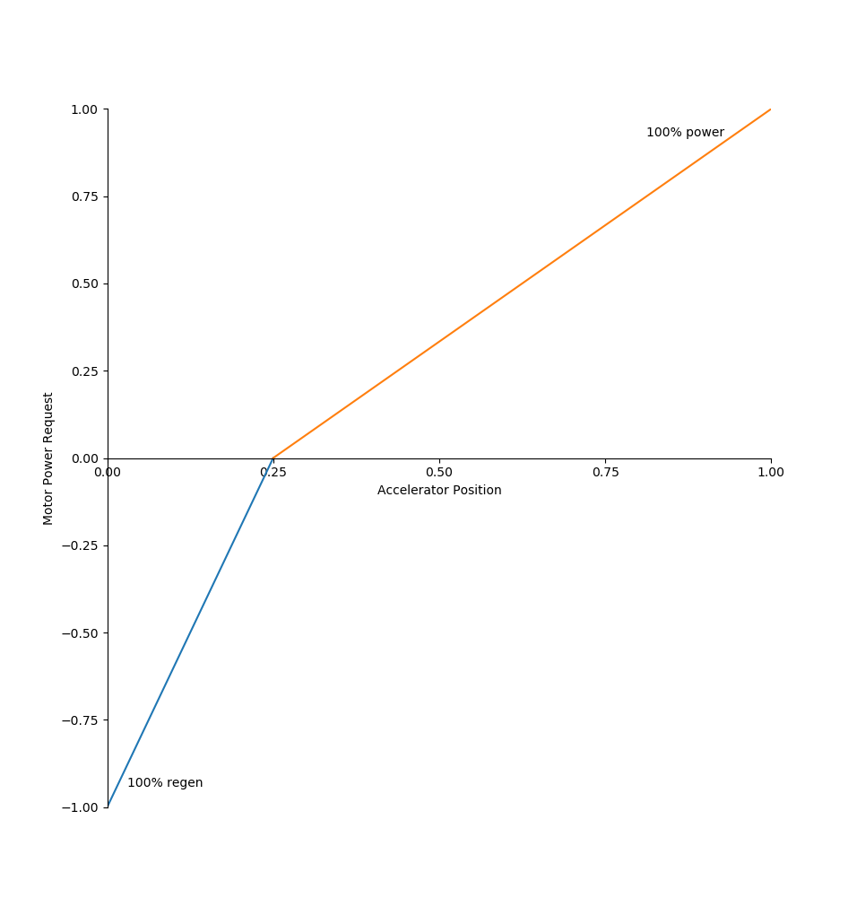
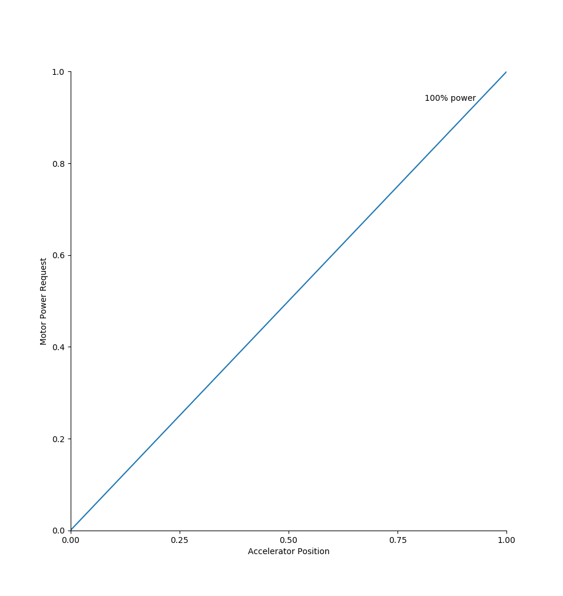
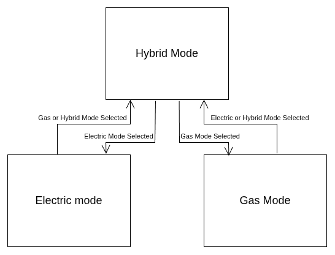
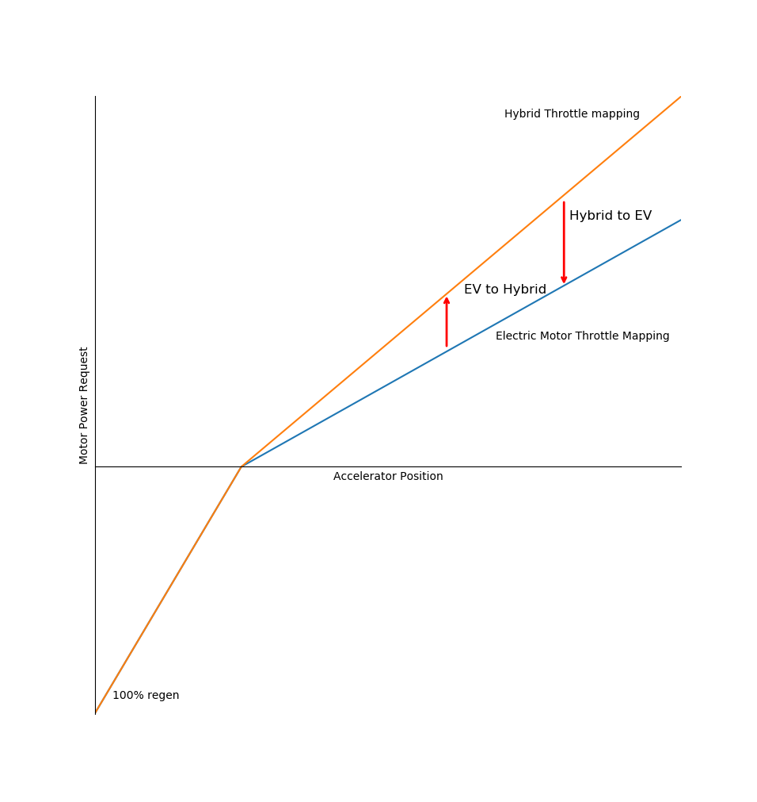
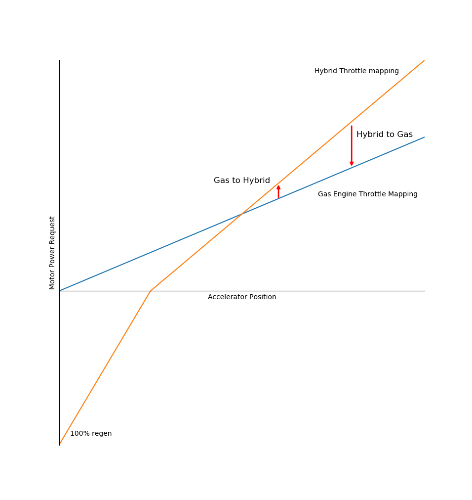

# Vehicle Control Module Design

## Driver Experience

Driver experience is important to consider with a custom project because the person who builds it tends to overlook complexity due to their deep knowledge of how everything works. 
I would like to ensure that if needed somebody else could drive the vehicle in an emergency situation or even just to borrow it.
If this were a commercial product, the expectation would be that this vehicle can be driven by anybody who has driven a car before with no explanation.
However, because a significant motivation for this project is making something I think is cool there may be some compromises to the user experience so that the result is something I enjoy.

### Transmission

I find manual transmissions much more engaging, and I like the fact that they are usually extremely durable with few failure points.
For this project, I think an automatic transmision would result in a better driver experience, especially for people unfamiliar with the internal workings of the hybrid system.
It makes operating the vehicle consistent regardless of drive mode.
Regardless of electric, hybrid, or gas only modes, making the vehicle move is as simple as pressing an accelerator pedal.
Using a manual transmission would force the driver to use a transmission in some drive modes but not others which is confusing.
Using an automatic transmission also frees up more room for a passenger in the front middle seat.
Personally I'm not a fan of automatic transmissions. The fact that the internal clutches wear out with every shift and are much harder to replace than the single clutch of a manual transmission bothers me in an illogical way.

But I recognize that an automatic transmission would have the best user experience in this project, and would simplify the implementation of the powertrain controller since manual transmissions often lack sensors for determining the current gear.
There is a good chance I will eventually get over my feelings about automatic transmissions but for now this design will be broad enough that either a manual or automatic transmission could be used.

Regardless of transmission choice, steering and stopping shall require no explanation for safety purposes. The brake pedal will be mounted in a standard location and will always engage the brakes regardless of drive mode.
The same thing applies for the steering wheel.
Regardless of drive mode, the steering wheel shall behave the same.

### Drive Modes

The [System Requirements](requirements_analysis.md#functional-requirements) state that the vehicle must have selectable hybrid and EV-only drive modes.
Because the parallel hybrid architecture allows the combustion engine to deliver power to the wheels as well, there will be a third drive mode which only uses the combustion engine.

#### Electric

Electric drive mode (aka EV mode) does not use the combustion engine at all.
In this drive mode the electric motor is coupled to the rear wheels leaving the combustion engine decoupled.
It shall be possible to turn on the combustion engine and let it idle, e.g. to warm it up, while staying in electric drive mode. 
In the electric drive mode the shifter will not be used.
In electric mode, the gas pedal acts as a power request.

##### Accelerator Pedal Mapping

The further the pedal is pressed, the higher the fraction of available motor torque is requested from the motor.
When the pedal is not pressed, or pressed very little, the power request will be negative and the electric motor will perform regenerative braking (regen).
The throttle response may take some tuning to feel good.
A first pass estimate with a linear response in the acceleration and regen regions is shown in the following plot.

<figure markdown="span">
  
  <figcaption>Electric Mode Throttle Mapping</figcaption>
</figure>

#### Gas

Gas only drive mode decouples the electric motor from the drivetrain and does not use it at all.
Driving in gas mode is just like driving any other manual transmission combustion engine vehicle.
Just like electric mode, the gas pedal acts as a power request to the engine.
Note that the power request is gross not net.
When the pedal is released, engine braking will slow the vehicle.

##### Accelerator Pedal Mapping

The further the accelerator is pressed the higher the fraction of available motor torque is requested from the engine.

<figure markdown="span">
  
  <figcaption>Gas Mode Throttle Mapping</figcaption>
</figure>

#### Hybrid

Hybrid mode uses both the electric motor and combustion engine.
Driving in hybrid mode feels like a combination of driving a regular combustion engine vehicle and an EV.
The transmission must be shifted to keep the combustion engine in the optimal range, but when the accelerator pedal is not pressed or slightly pressed the electric motor does regen braking.
When in hybrid mode the power requested is provided by either the electric motor or the combustion engine depending on the power requested, battery state of charge, etc. to attempt to provide the greatest efficiency.

##### Accelerator Pedal Mapping

The accelerator mapping for hybrid mode is essentially the same as EV mode, with a scaling factor applied to the acceleration regen because the gas and electric motor both can supply power simultaneously.
At low accelerator pedal displacements the electric motor does regeneration.
Once out of regen, the more the pedal is pressed, the greater the power request from the engine.

<figure markdown="span">
  
  <figcaption>Hybrid Mode Throttle Mapping</figcaption>
</figure>

##### Clutch Behavior

This section only applies if the transmission used is a manual transmission.
When the clutch is pressed any amount, the electric motor is coasted.
The power requested by the accelerator pedal is still sent to the combustion engine so that it is possible to rev match for smoother shifts.

### Drive Mode Selection

Drive mode should be selected in a user friendly way.
A simple 3 position toggle switch with labels is clear enough and fits with the 1960s aesthetic.
To facilitate smooth transitions between modes, it will not be possible to switch directly from gas to electric mode and vice versa.
Instead, transitions between electric and gas mode will pass through the hybrid drive mode so that torque can be applied during the entire mode transition.
Since the drive mode state machine is relatively complex and the drive mode does not switch instantaneously, information about the status of the drive mode switch can be displayed on the vehicle display for diagnostic purpose.

<figure markdown="span">
  
  <figcaption>Drive mode Selection</figcaption>
</figure>

#### Accelerator Mapping Transition

Because the throttle mapping in each drive mode is not the same there must be a transition when switching drive modes.
When transitioning out of hybrid mode to gas / electric mode the throttle mapping will shift from the hybrid drive mode map to the map of the new drive mode over a span of ~2s before the shift out of hybrid mode.
When transitioning into hybrid mode from gas / electric mode the previous throttle mapping will persist until the drive mode has switched to hybrid mode.
Once in hybrid mode, the throttle map shifts to the hybrid map over a span of ~2s.
When shifting between drive modes while keeping the accelerator pedal in the same position the amount of power being requested will change which will most likely require the driver to adjust the position of their foot.

<figure markdown="span">
  
  <figcaption>EV and Hybrid Throttle Map Transition</figcaption>
</figure>

<figure markdown="span">
  
  <figcaption>Gas and Hybrid Throttle Map Transition</figcaption>
</figure>

### Display

To display information about the hybrid system, and potentially host an infotainment system like Apple CarPlay or Android Auto there will be a small screen on or under the dishboard. The placement of the screen will be determined once the donor body is acquired so that minimal modifications are needed to the dashboard. 

## Steering 

Steering is done through a steering wheel just like any other car.
The existing steering wheel on the donor vehicle will be reused.
Having power steering is preferred, but whether the vehicle has power steering or not will depend on if the donor body already has power steering (optional feature at the time) or a manual steering rack.
Manual steering racks do take a lot of effort when stationary, but once moving the steering effort is similar, especially since manually steering boxes usually have a higher gear ratio making steering easier but requiring more movement of the wheel.

## Brakes

Similarly power brakes are preferred (also an optional feature in the 60s) over non-power brakes but whether the vehicle has power brakes initially will be determined by whether the donor vehicle already has them.
Power brakes are capable of delivering just as much stopping power and locking up the wheels, it just takes more force.
Just like manual steering, power steering pedals / brackets and master cylinders are usually set up to deliver a greater force ratio at the expense of requiring more pedal travel.

## Parking Brake

The vehicle must have both a parking / emergency brake and a transmission brake.
If the transmission is a manual transmission the transmission brake is as simple as leaving the transmission in gear.
There must be some provisions to ensure that the transmission brake is always engaged when leaving the vehicle in park, e.g. ensuring the transmission is always coupled to the wheels when stopping the vehicle.
